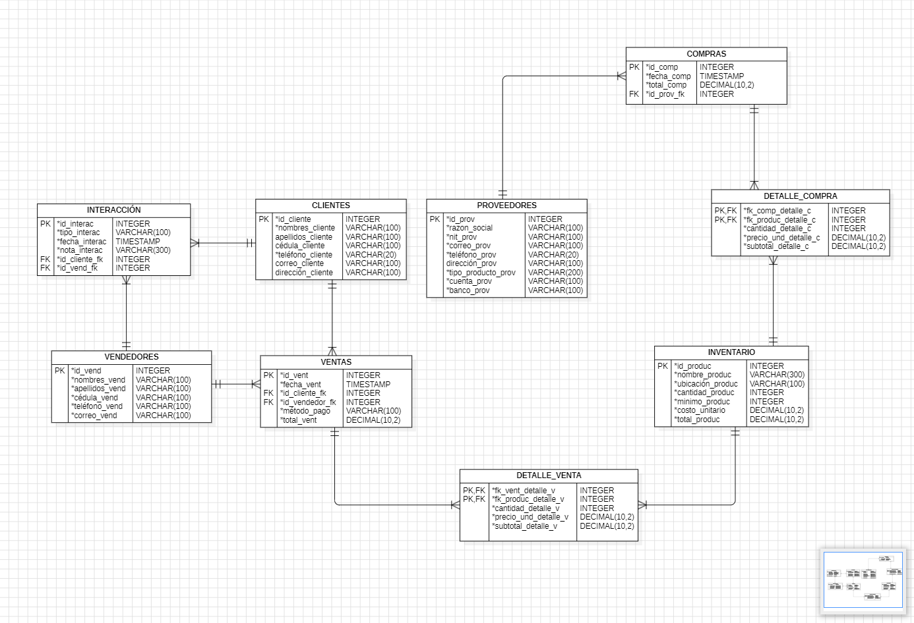
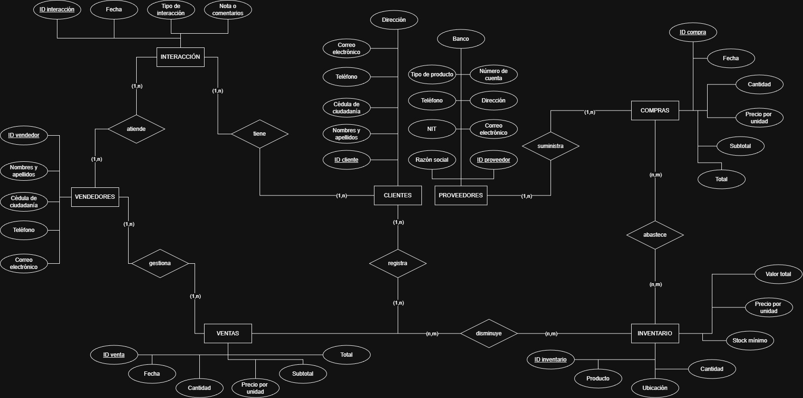

# 🚲 Proyecto CampusBike - Base de Datos
Repositorio oficial de la arquitectura de base de datos para el sistema de gestión de CampusBike.

## 📊 Documentación de la Arquitectura
A continuación se detallan las relaciones y entidades del sistema:

### Modelo Relacional

### Modelo Entidad-Relación

## 🚀 Características Técnicas
- **Motor:** MySQL / MariaDB.
- **Optimización:** Columnas generadas para cálculos de `total_produc` y `subtotal_detalle`.
